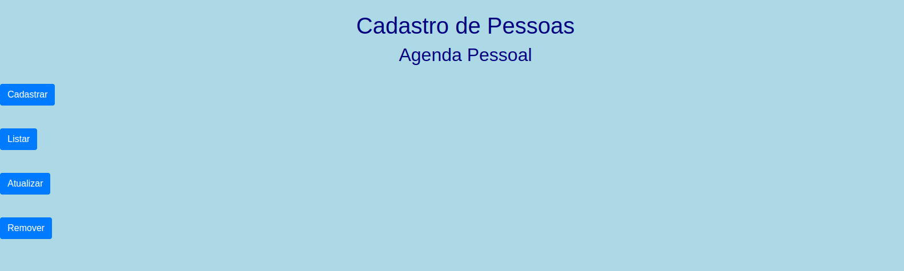
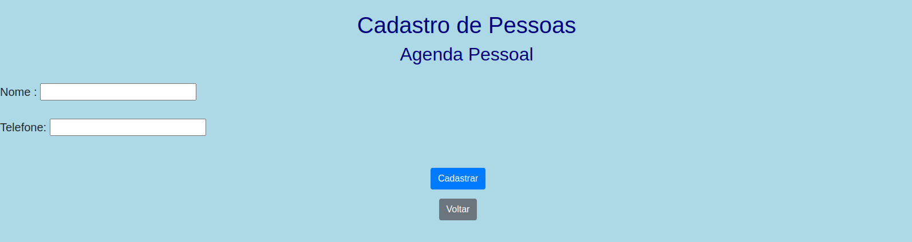
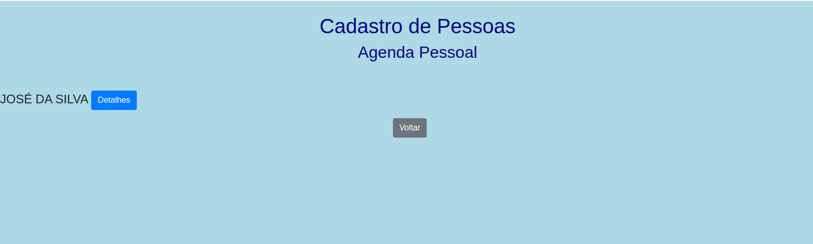
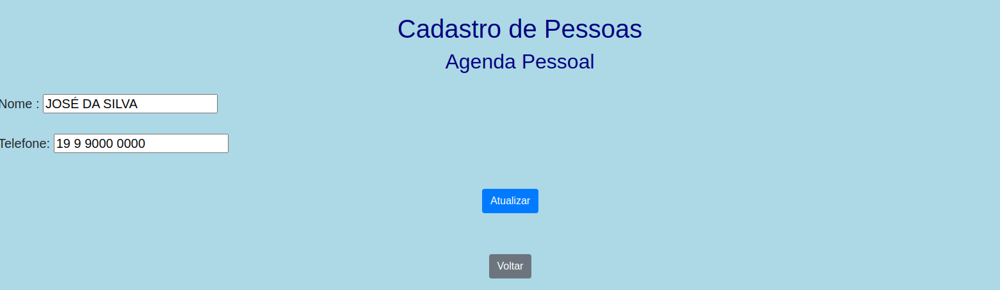
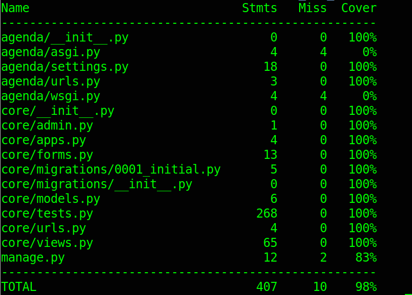
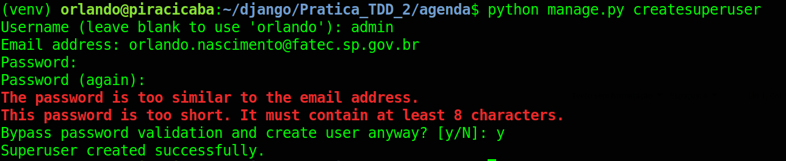
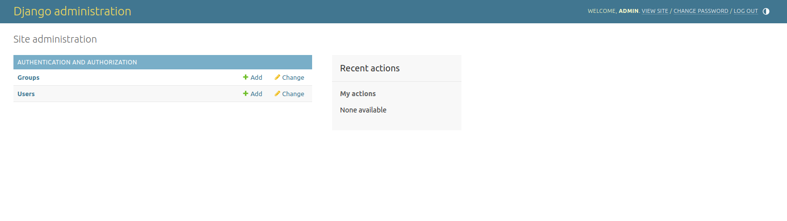

# Prática TDD

Desafio técnico para os alunos da disciplina "Desenvolvimento Web 3"

No ambiente Linux:

```console
git clone https://github.com/orlandosaraivajr/Pratica_TDD_2.git
cd Pratica_TDD_2/
virtualenv -p python3 venv
source venv/bin/activate
pip install -r requirements.txt
cd agenda/
python manage.py migrate
python manage.py test
coverage run --source='.' manage.py test 
coverage html
python manage.py runserver
```

No ambiente Windows:

```console
git clone https://github.com/orlandosaraivajr/Pratica_TDD_2.git
cd Pratica_TDD_2/
virtualenv venv
cd venv
cd scripts
activate.bat
cd ..
cd ..
pip install -r requirements.txt
cd agenda/
python manage.py migrate
python manage.py test
coverage run --source='.' manage.py test 
coverage html
python manage.py runserver

```

### Requisitos da Sprint 1

O projeto apresenta um cadastro de agenda. Na rota raiz (/), se apresenta quatro botões, conforme imagem abaixo:


Ao acessar a rota cadastro (/create), é possível cadastrar o contato, que armazena as seguintes informações:

- Nome
- Telefone



Ao acessar a rota read (/read), Nenhum contato está cadastrado:


Após cadastrar um contato, rota listar (/read), lista todos os contatos cadastrados:



Ao acessar a rota update (/update), é possível selecionar e atualizar um contato:





Ao acessar a rota delete (/delete), é possível remover um contato:


Todos os testes unitários estão passando, e o sistema funciona como previsto para a primeira sprint.



## Requisitos para a Sprint 2

Aqui começa seu desafio. 
Para começar, você precisa criar um superusuário:



Crie um superusuário com as seguintes credenciais:

- Username <b>admin</b>:
- E-mail address <b>seu e-mail institucional</b>:
- Password <b>fatec</b>:

Acessar a Área do Django-Admin, registrar o modelo AgendaModel. Como visto na imagem abaixo, o modelo não está registrado.



## Novo campo
O cliente deseja armazenar um novo campo:

+ CPF

Adicione um campo do tipo CharField com tamanho máximo de 30 caracteres. Não se esqueça de definir o valor default como ''.

## Validação do novo campo

O cliente deseja validar os campos com a seguinte regra:

+ CPF: Espera-se exatos 11 caracteres.

Todos os campos serão são obrigatórios.

## Exibir novo campo nos templates

1. Exibir o campo CPF em cadastro.html
2. Exibir o campo CPF em detalhes.html
3. Exibir o campo CPF em detalhes2.html


## Ajustes nos testes

O código fonte passará por atualizações para acomodar estes novos requisitos. Com isso, você deve ajudar os testes existentes e, caso julgue pertinente, criar novos testes.

Você recebeu a sprint 1 com uma cobertura de teste acima de 90%. É esperado que ao final da sprint 2 a cobertura mantenha-se neste patamar.

